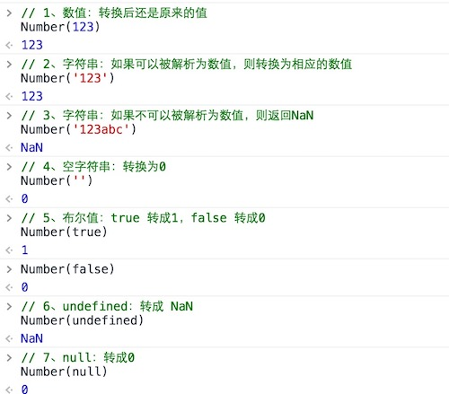
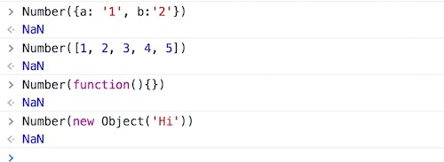
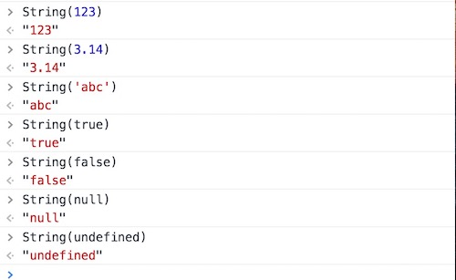
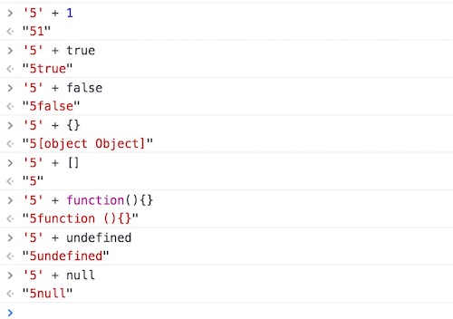
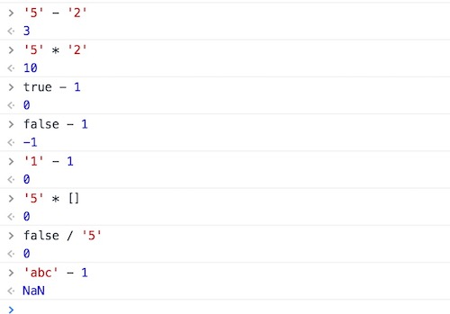
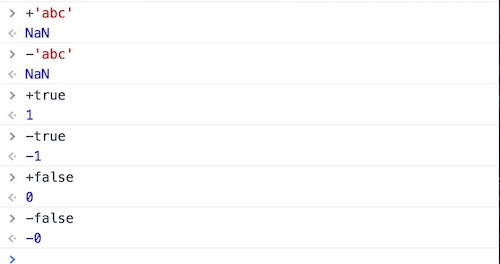

# 一、 注释与语句

## 1、注释

- 单行注释：`//`
- 多行注释：`/**/`

> 提示：单行注释不能折行，可以嵌套；多行注释可以折行，不能嵌套；

## 2、 语句

一段脚本就是一系列计算机能够一步一步执行的指令。每一条单独的指令或步骤就被称为一条语句。语句以分号（`;`）结尾，多个语句可以写在一行内。

```javascript
var a = 10;                // 这是一条赋值语句
var b = 10; var c = a + b; // 多条语句可以写在一行内；
```

> 提示：分号在 JavaScript 不是必须的，但为了养成良好的编码习惯，建议每一条语句之后都加上分号。

## 3、输出

1）、控制台输出

```javascript
var name = 'Petter';

// 1、输出字符串
console.log('Hello, world!');
// "Hello, world!"

// 2、输出变量
console.log(name);
// "Petter"

// 3、输出变量/字符串
console.log('Hello, ' + name + '!');
// "Hello, Petter!"
```
2）、页面输出

```javascript
document.write('Hello, world!');
```

3）、提示框输出

```javascript
alert('Hello, world!');
```

# 二、 变量


脚本必须暂时地存储一些完成工作所需的信息，可以将这些数据存储在变量中，变量是对“值”的引用，使用变量等同于引用一个值。每一个变量都有一个变量名。定义变量使用 `var` 关键字。

```javascript
var a = 10;
```

## 1、声明与赋值

```javascript
var a;  // 声明变量a
a = 10; // 为变量a赋值
```

> 提示：你可以将变量的声明与赋值放在一起，一步到位，如 `var a = 10`，这种定义变量的方式被称为字面量定义，即在声明的同时为变量赋值。

如果只是声明变量而不为其赋值，则该变量的值是`undefined`。`undefined` 是一个JavaScript 数据类型，表示未定义。

```javascript
var a;
a; // undefined
```

你可以在同一行中声明多个变量。

```javascript
var a = 10, name = 'Henrry Lee';
```

> tips 1：变量一定先声明，后使用，如果访问一个未定义的变量，程序将报错：
>
> ```javascript
> console.log(a);
> // Uncaught ReferenceError: a is not defined
> ```

> tips 2：变量为可变量，可以修改变量的值：
>
> ```javascript
> var a = 10;
> a; // 10
>
> a = 20;
> a; // 20
> ```

> tips 3：JavaScript 允许重复定义变量，如果重复定义，之前的值将会被覆盖，如果只定义不赋值，则新定义的变量无效：
>
> ```javascript
> // 定义变量a
> var a = 10; 
> console.log(a); // 10
>
> // 重复定义变量a
> var a;
> console.log(a); // 10
>
> var a = 20;
> console.log(a); // 20
> ```

## 2、类型推断与typeof

JavaScript是一种动态类型的语言，也就是说变量的类型没有限制，可以赋予各种类型的值，变量的类型在赋值之后确定，JavaScript本身存在一种类型推断机制，所谓类型推断，就是根据变量的值确定变量的类型。通过 `typeof` 可以查看变量的数据类型。

```javascript
var a;
a = 10; typeof a; // 'number'
a = true; typeof a; // 'boolean'
a = 'Henrry Lee'; typeof a; // 'string'
a = function(){}; typeof a; // 'function'
a = {age:26}; typeof a; // 'object'
```


# 三、 标识符

标识符（identifier）是用来识别具体对象的一个名称。最常见的标识符就是 “变量名 ”，以及后面要提到的 “函数名 ”。JavaScript语言的标识符对**大小写敏感**，所以*a*和*A*是两个不同的标识符。标识符的命名规则如下：。

- 必须以字母、美元符号(**$**)以及下划线（**_**）开头，不能以数字开头；
- 名字可以包含字母、数字、美元符号或下划线。注意，在变量中不能使用连字符(***-***)和点(***.***)号；
- 不能使用关键字或保留字来对变量命名。
- 所有的变量都是大小写敏感的，变量 `x` 与变量 `X` 是不一样的；
- 变量命名必须见名知意，语义化，如创建一个数字变量，名字可以取名为*number*，不能使用拼音或中文命名变量；
- 如果变量的名字由多个单词组成，则应遵守**驼峰命名**法则，即第一个单词首字母小写，后面单词首字母大写，如一个描述人的姓名的变量，正确的变量命名应该是*personName*;

# 四、关键字与保留字

在上一节中我们提到了两个词语——“**关键字**”和“**保留字**”，就是我们在进行变量命名的时候需要避免使用的两类名称。所谓“关键字”，就是JavaScript现在正常使用的一些名称，它们可能是系统变量名，也可能是一个JS内置的方法函数名，还可能是已知宿主环境提供的API。而“保留字”是现在暂时没有使用，但在未来JavaScript可能会使用的名称，这些“保留字”经过JS不断的发展，已经有一些成为了“关键字”。

- 关键字

| break    | do     | instanceof | typeof    | if       | else      |
| -------- | ------ | ---------- | --------- | -------- | --------- |
| case     | var    | new        | finally   | return   | void      |
| continue | for    | switch     | while     | debugger | function  |
| this     | with   | try        | catch     | throw    | delete    |
| default  | in     | implements | package   | public   | interface |
| private  | static | let        | protected | yield    |           |

- 保留字

| abstract | enum    | int    | short | boolean | export       |
| -------- | ------- | ------ | ----- | ------- | ------------ |
| byte     | extends | long   | super | native  | synchronized |
| class    | float   | throws | const | goto    | transient    |
| volatile | double  | import |       |         |              |

但是需要明白的是JavaScript中的“关键字”和“保留字”也不是一成不变的，它们也会随着这个语言的发展新增或删除（例如“debugger”就是ECMAScript 5中新增的关键字）。但考虑到“向上兼容”，以前提出的这些“关键字”和“保留字”也应该在规范出现更改之后也避免去使用，以免造成程序异常。

# 五、变量作用域

JavaScript变量分为“局部变量”和“全局变量”。所谓“局部变量”就是指所定义的变量只会在一个限定的范围内生效，通常指在某一个函数（function）内。而通过全局的方法或者其它函数是无法获取该变量的值的。

而“全局变量”，它的值可以被所有的方法或函数获取到。通常将一个变量写在所有函数的外部的变量，就叫做“全局变量”，但是在函数内部，若忘记在变量名前加上`var`的话，该变量也会成为全局变量，从而不小心被其它函数将值给误改了，所以在函数内部一定要记得在变量名前加上关键字 `var` 来定义一个变量。

```javascript
var a = "全局变量";
function print() {
  // a 为全局变量，在任意位置都可以访问
  console.log(a);    
}

function test(y) {
  // 参数 y 也为局部变量
  // x 在函数内部创建，为一个局部变量
  var x = "局部变量"; 
}
console.log(x); // x 为局部变量，此处不能访问x变量，程序会报错
console.log(y); // y 为局部变量，此处不能访问y变量，程序会报错    
```

变量作用域表示变量起作用的范围，全局变量的作用域为整个文件内部，称之为**全局作用域**。而局部变量的作用域通常限于函数内部，称之为**函数作用域**。

```javascript
// 立即执行函数
(function () {
    var str = 'Hello, World!';
    console.log(str);
})();
```

# 六、 运算符与表达式	

## 1、 基本运算符

  基本运算符主要用于一些数值操作

- `+`：加法运算符，如 `a + b`
- `-`：减法运算符，如 `a - b`
- `*`：乘法运算符，如 `a * b`
- `/`：除法运算符，如 `a / b`
- `%`：模运算（取余数），如 `a % b`
- `++`：自增运算符（自身+1）
- `--`：自减运算符（自身-1）

> 提示：自增与自减运算符都是让自身 `+1` 或 `-1`，在使用上无差别，这里以自增运算符为例。
>
> 1）、无论 `++` 运算符在变量前还是在变量后，变量自身都会 `+1`
>
> ```javascript
> var a = 10;
> a++; // 11
> ++a; // 12
> ```
>
> 2）、`++` 在前，先自增、再赋值；`++` 在后，先赋值，再自增
>
> ```javascript
> var a = 10;
> var x = ++a; // x = 11, a = 11
>
> var a = 10;
> var x = a++; // x = 10, a = 11
> ```

## 2、 赋值运算符

赋值运算符是为JavaScript中的变量赋值，即将该运算符右方计算出的值赋予左侧的变量。

- `=`：赋值运算符，如 `x = 10;` ，将 `10` 赋值给变量 `x`
- `+=`：变量与值相加，如 `x += y;` 相当于 `x = x + y`
- `-=`：变量与值相加，如 `x -= y;` 相当于 `x = x - y`
- `*=`：变量与值相加，如 `x *= y;` 相当于 `x = x * y`
- `/=`：变量与值相加，如 `x /= y;` 相当于 `x = x / y`
- `%=`：变量与值相加，如 `x %= y;` 相当于 `x = x % y`

## 3、 关系运算符

关系运算符描述两个变量的关系，其返回值类型为布尔类型（boolean），即 `true` 和 `false`。

- `==`：判断两个变量是否相等，如 `'Henrry Lee' == 'Henrry Lee'`，返回 `true`
- `>`：判断等号左边的变量是否大于等号右边的变量，如 `20 > 10`，返回 `true`
- `<`：判断等号左边的变量是否小于等号右边的变量，如 `20 < 10` ，返回 `false`
- `>=`：判断等号左边的变量是否大于等于等号右边的变量，如 `20 >= 10`，返回 `true`
- `<=`：判断等号左边的变量是否小于等于等号右边的变量，如 `20 <= 10`，返回 `false`
- `===`：恒等于，要求不仅数据类型要一致，值也要一致，如 `1 === '1'`，返回 `false`
- `!==`：不恒等于，只要类型或值不一样，结果为true，如 `1 !== '1'`，返回 `true`

## 4、 逻辑运算符

逻辑运算符是JavaScript用于判断几条语句成立情况的一种运算，该运算符的返回值类型为布尔类型。

- 逻辑与：`&&` ，同时为真才为真，如 `(1 > 2) && (2 > 3)`，返回 `false`
- 逻辑或：`||` ，同时为假才为假，如 `(1 > 2) || (2 > 3)`，返回 `true`
- 逻辑非：` !` ，取反，如 `!(1 > 2)`，返回 `true`

## 5、 三元运算符

三元运算用于条件判断，根据判断的结果执行不同的语句，其语法形式为：`a ? b : c`。如果a表达式的条件为真，则执行b语句，否则执行c语句。我们来看一个示例：

```javascript
var isLogin = true; // 定义变量’isLogin‘用于记录登录状态
isLogin ? console.log('已登录！') : console.log('未登录！');
```

上述代码使用三目运算符根据登录状态执行不同的语句，代码中的 `console.log()` 函数用于向控制台输出信息。由于定义的变量值为true，因此上述代码执行后会在控制台输出：“您已登录！”

# 七、 基本数据类型

数据类型决定了如何将值存储到计算机的内存中。和其它编程语言一样，JavaScript也有自己的数据类型，主要有以下6种：

## 1、数值类型（number）

该类型是用于表示阿拉伯数字的数据类型，可以是“0”、正数、负数、浮点数（小数）。数值型的值可以参与数学运算。

##2、字符串类型（string）

该类型用于表示如“英文”，“中文”，“其它国家语言”，“键盘上的符号”，“特殊编码”等字符，甚至可以是数字。该类型的值都需要用一对英文引号（可以是单引号，也可以是双引号）阔起来，否则在使用该变量的时候会报出未定义的错误，成为一个“未定义”类型，而本想作为字符串的数字也会成为一个“数值型”。

## 3、布尔类型（boolean）

该类型只有两个值，即：
- true：表示“是”，在判断语句中可以用“非0”、“非undefined”、“非null”、“非NaN”、“字符串”、“对象”甚至是一个“函数”表示
- false：表示“否”，在判断语句中可以用数值“0”、“undefined”、“null”或“NaN”表示。

## 4、对象类型（object）

该类型用于表示一个对象，在JavaScript中并没有“数组”这个类型，所以数组在JavaScript里也作为一个对象，空值`null`也是一个对象。在JavaScript中可以通过语句“new Object()”来创建一个对象来赋给某一个变量。以下为对象的示例代码：

```javascript
var a = new Object();    // 对象
var b = [1, 2, 3, 4, 5]; // 数组对象
var d = {
	name: "Henrry Lee",
	gender: "male",
	e_mail: "lihy_online@163.com",
	age: "24",
	github: "https://github.com/LiHongyao"
}
var e = {
	stu1: {name:"Q", age:"23", grade="A"},
	stu2: {name:"K", age:"22", grade="B"},
	stu3: {name:"J", age:"23", grade="A+"},
}
```

当然，上例中的这种写法只是一种示例，用于表示对象的格式。实际生产环境中，每个变量对象的值都是动态地从服务器端的数据库通过一定的代码手段获取的。示例中的变量“d”和“e”对象的格式也就是Web技术领域中常会提到的“JSON格式”（JavaScript Object Notation，JavaScript的对象表示法），从名称就能看得出来，它所表示的数据类型正是一个“对象”。现在编程中的“面向对象思维”或“面向对象编程”正是在这个“对象类型”的基础上开展的。

## 5、函数类型（function）

该类型表示变量的类型为一个可运行的“函数”。一个函数内包含一组语句（至少一条语句），通过这些语句的组合去实现一个特定的功能。

```javascript
// 定义函数
function sum(a, b) {
    return a + b;
}
// 调用函数
var result = sum(10, 20);
console.log(result); // 30
```

函数类型是JavaScript中最复杂的一个数据类型，但它在JavaScript中扮演中相当重要的作用，它也同是**面向对象编程**中一个非常核心的内容。函数的设计非常大程度地决定了一个网站或应用的性能。从编程角度来讲，它直接影响到了代码的可复用性，代码量，可以维护性，可扩展性等因素。这个对于JavaScript的初学者来说也是最难掌握好的一个部分，就算一个已经工作了好几年的Web前端开发工程师，在对函数的组织和优化上都会下不少功夫。

## 6、未定义（undefined）

该类型出现于调用一个变量时，该变量不存在或未定义值时产生的类型。很多时候这个值的出现是由于编程中的粗心造成的，但在有的时候会刻意地“制造”出这个类型，或者说是利用这个类型去完成程序中的一些特殊的功能。

# 八、类型转换

JavaScript是一种动态类型语言，变量没有类型限制，可以随时赋予任意值。

```javascript
var x = y ? 3.14 : "china";
```

上面代码中，变量 `x` 到底是数值还是字符串，取决于另一个变量 `y` 的值。只有在代码运行时，才可能知道 `x` 的类型。虽然变量没有类型，但是数据本身和各种运算符是有类型的。如果运算符发现，数据的类型与预期不符，就会自动转换类型。比如，减法运算符预期两侧的运算子应该是数值，如果不是，就会自动将它们转为数值。

```javascript
'4' - '3' // 1
```

上面代码中，虽然是两个字符串相减，但是依然会得到结果 `1`，原因就在于JavaScript将它们自动转为了数值。

## 1、强制转换

强制转换主要指使用 `Number()`、`String()` 和  `Boolean()` 三个构造函数，手动将各种类型的值，转换成数字、字符串或者布尔值。

### 1.1、 Number() 

使用 `Number` 函数，可以将任意类型的值转化成数值。下面分成两种情况讨论，一种是参数是原始类型的值，另一种是参数是对象。

#### 1.1.1、 原始类型值的转换规则

  原始类型的值主要是字符串、布尔值、undefined 和 null，它们都能被 Number 转成数值或 NaN（not a number 非数字）。



`Number` 函数将字符串转为数值，要比 *parseInt* 函数严格很多。基本上，只要有一个字符无法转成数值，整个字符串就会被转为*NaN*。


上面代码中，`parseInt` 逐个解析字符，而 `Number` 函数整体转换字符串的类型。

#### 1.1.2、 对象的转换规则

简单的规则是，`Number` 方法的参数是对象时，将返回 `NaN`。



### 1.2 、String()

使用 `String` 函数，可以将任意类型的值转化成字符串。转换规则如下。

#### 1.2.1、 原始类型值的转换规则

- **数值**：转为相应的字符串。
- **字符串**：转换后还是原来的值。
- **布尔值**：*true*转为*"true"*，*false*转为*"false"*。
- **undefined**：转为*"undefined"*。
- **null**：转为*"null"*。



#### 1.2.2、 对象的转换规则

`String` 方法的参数如果是对象，返回一个类型字符串；如果是数组，返回该数组的字符串形式。


### 1.3 、Boolean()

使用 `Boolean` 函数，可以将任意类型的变量转为布尔值。它的转换规则相对简单：除了以下六个值的转换结果为 `false` ，其他的值全部为 `true。

- **undefined**
- **null**
- **-0**
- **0**或**+0**
- **NaN**
- **''**（空字符串）


> 注意，所有对象（包括空对象）的转换结果都是*true*，甚至连*false*对应的布尔对象*new Boolean(false)*也是*true*。


  所有对象的布尔值都是 `true`，这是因为JavaScript语言设计的时候，出于性能的考虑，如果对象需要计算才能得到布尔值，对于 `obj1 && obj2` 这样的场景，可能会需要较多的计算。为了保证性能，就统一规定，对象的布尔值为 `true`。

## 2、自动转换

  下面介绍自动转换，它是以强制转换为基础的。

  遇到以下三种情况时，JavaScript会自动转换数据类型，即转换是自动完成的，对用户不可见。

```javascript
// 1. 不同类型的数据互相运算
123 + 'abc' // "123abc"

// 2. 对非布尔值类型的数据求布尔值
if ('abc') {
  console.log('hello')
}  // "hello"

// 3. 对非数值类型的数据使用一元运算符（即“+”和“-”）
+ {foo: 'bar'} // NaN
- [1, 2, 3] // NaN
```

  自动转换的规则是这样的：预期什么类型的值，就调用该类型的转换函数。比如，某个位置预期为字符串，就调用***String***函数进行转换。如果该位置即可以是字符串，也可能是数值，那么默认转为数值。

  由于自动转换具有不确定性，而且不易除错，建议在预期为布尔值、数值、字符串的地方，全部使用 *Boolean()*、*Number()* 和 *String()* 函数进行显式转换。

### 2.1 自动转换为布尔值

  当JavaScript遇到预期为布尔值的地方（比如`if`语句的条件部分），就会将非布尔值的参数自动转换为布尔值。系统内部会自动调用 **Boolean**函数。

  因此除了以下六个值，其他都是自动转为 `true`。

- **undefined**
- **null**
- **-0**
- **0**或**+0**
- **NaN**
- **''**（空字符串）

  下面这个例子中，条件部分的每个值都相当于 `false`，使用否定运算符后，就变成了 `true`。

```javascript
if ( !undefined
  && !null
  && !0
  && !NaN
  && !''
) {
  console.log('true');
} // true
```

### 2.2 自动转换为字符串

  当JavaScript遇到预期为字符串的地方，就会将非字符串的数据自动转为字符串。系统内部会自动调用 *String()* 函数。

  字符串的自动转换，主要发生在加法运算时。当一个值为字符串，另一个值为非字符串，则后者转为字符串。



  这种自动转换很容易出错。


  上面代码中，开发者可能期望返回 *120*，但是由于自动转换，实际上返回了一个字符 *10020*。

### 2.3 自动转换为数值

  当JavaScript遇到预期为数值的地方，就会将参数值自动转换为数值。系统内部会自动调用 *Number()* 函数。

  除了加法运算符有可能把运算子转为字符串，其他运算符都会把运算子自动转成数值。



  上面代码中，运算符两侧的运算子，都被转成了数值。

  一元运算符也会把运算子转成数值。



# 九、类型分类

通过按值来访问数据，其类型可分为两大类：

- 值类型：数值、布尔值、null、undefined...
- 引用类型：对象、数组、函数...


