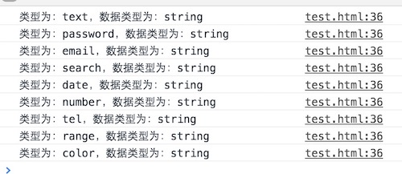

## 一、概述

  在JavaScript中，所谓的字符串就是包含在英文“双引号”或‘单引号’中的内容，可以是数字、运算符号、各国语言、特殊编码字符，甚至还能是HTML的标签。也就是说，只要符合在“双引号”或‘单引号’中这个要求，计算机文本中的内容基本上都可以成为一个字符串。

  获取一个字符串的途径非常多，特别是在进行表单操作的的时候，通过表单输入框（包括input标签的type属性为text、password、number、email、tel、date等的时候），哪怕是在输入一个纯数字的时候，得到的都是一个字符串。还有通过JS获取DOM元素节点中文本的***innerText***和***textContent***属性得到的字符也是一个字符串。

  我们先来看从一系列的表单元素中获取到的值的数据类型的例子：

```html
<form>
	<input type="text" value="123">
	<input type="password" value="123">
	<input type="email" value="123@qq.com">
	<input type="search" value="123">
	<input type="date" value="1993-07-16">
	<input type="number" value="123">
	<input type="tel" value="123">
	<input type="range" value="123">
	<input type="color" value="#008800">
</form>
<!-- js -->
<script type="text/javascript">
    // DOM操作，获取所有标签名为input的节点，返回数组;
	var elements = document.getElementsByTagName('input');
	// 获取数组长度
	var length = elements.length;
	// 遍历inputs
	for (var i = 0; i < length; i++) {
		var getType = elements[i].type;
		var getValue = elements[i].value;
		// 在控制台输出type的类型与数据的类型
		console.log("类型为：" + getType + "，数据类型为：" + typeof(getValue));
	}
</script>
```

  打开浏览器控制台后，得到的结果为：



  再来看一个通过innerText属性和textContent属性获取到的文本内容的数据类型的例子：

```html
<p>文本段落</p>
<p>123456789</p>

<script type="text/javascript">
	var elements = document.getElementsByTagName('p');
	for (var i = 0; i < elements.length; i++) {

		var element = elements[i];
		var innerText = element.innerText;
		var textContent = element.textContent;

		console.log("--------------------------------------------------------")
		console.log("段落" + (i + 1) + "通过innerText获取到的文本内容是：" + innerText);
		console.log("段落" + (i + 1) + "内容的数据类型为：" + typeof(innerText));
		console.log("段落" + (i + 1) + "通过textContent获取到的文本内容是：" + textContent);
		console.log("段落" + (i + 1) + "内容的数据类型为：" + typeof(textContent));
		console.log("--------------------------------------------------------")
	}
</script>
```

  打开浏览器控制台后，得到的结果为：


# 二、字符串引号使用规则

  在使用字符串的引号时需要注意，如果一个字符串已经使用过引号，若需要再在字符串内使用引号需要使用另外一个引号，即双引号内使用单引号，单引号内使用双引号，或者使用***转义符“\”***对同样的引号进行转换，多层引号嵌套，该规则同样适用，如：

```javascript
var x = "Hello, I'm Petter!";
var y = 'How do you think about "JavaScript"?';
var z = "设置字体的'颜色'代码是：<p style=\"color:red;\">";
```

  需要了解的一个字符串的常识就是，字符串不能直接分成多行去写，否则浏览器会报错。但如果，每行都加上完整的引号，返回的值又只会有最后一个字符串，不能获取到完整的字符串。如果字符串过长，需要进行换行使视觉层次上更加地清晰，那需要这样去写：

```javascript
var x = "这是一个\
         分行写的\
         字符串";
console.log(x); // 输出：这是一个分行写的字符串

// 或者，你还可以这样写
var x = "这是一个" + 
        "分行写的" +
        "字符串";
console.log(x); // 输出：这是一个分行写的字符串
```

  如果使用上例中的“`\`”进行字符串的分行需要特别注意的是，在“`\`”后除了换行符之外不能加上任何符号，包括空格，否则浏览器会报出“无效或意外的标记（Invalid or unexpected token）”的错误。考虑到这一点，实际程序中更多地是使用字符串拼接符“`+`”来拼接字符串，一来可以避免“`\`”产生的歧义（因为它是一个转义操作符），二来也不用小心翼翼地防止出现“习惯性空格”带来的错误。