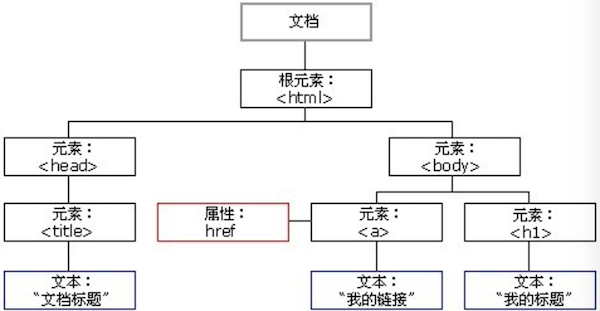

# 一、概述

## 1、基本概念

### 1.1、DOM

  DOM是JavaScript操作网页的接口，全称为“***文档对象模型***”（Document Object Model）。它的作用是将网页转为一个JavaScript对象，从而可以用脚本进行各种操作（比如增删内容）。

  浏览器会根据DOM模型，将结构化文档（比如HTML和XML）解析成一系列的节点，再由这些节点组成一个树状结构（DOM Tree）。所有的节点和最终的树状结构，都有规范的对外接口。所以，DOM可以理解成网页的编程接口。DOM有自己的国际标准，目前的通用版本是DOM 3，下一代版本DOM 4正在拟定中。

  严格地说，DOM不属于JavaScript，但是操作DOM是JavaScript最常见的任务，而JavaScript也是最常用于DOM操作的语言。本章介绍的就是JavaScript对DOM标准的实现和用法。

### 1.2、节点

  DOM的最小组成单位叫做节点（node）。文档的树形结构（DOM树），就是由各种不同类型的节点组成。每个节点可以看作是文档树的一片叶子。

  节点的类型有七种：

- ***Document***：整个文档树的顶层节点（**重点**）
- ***DocumentType***：*doctype*标签（比如*<!DOCTYPE html>*）
- ***Element***：网页的各种HTML标签（比如*<body>*、*<a>*等）（**重点**）
- ***Attribute***：网页元素的属性（比如*class="right"*）（**重点**）
- ***Text***：标签之间或标签包含的文本（**重点**）
- ***Comment***：注释
- ***DocumentFragment***：文档的片段

  这七种节点都属于浏览器原生提供的节点对象的派生对象，具有一些共同的属性和方法。

### 1.3、节点树

  一个文档的所有节点，按照所在的层级，可以抽象成一种树状结构。这种树状结构就是DOM。

  最顶层的节点就是***document***节点，它代表了整个文档。文档里面最高一层的HTML标签，一般是***\<html>***，它构成树结构的根节点（root node），其他HTML标签节点都是它的下级。

  除了根节点以外，其他节点对于周围的节点都存在三种关系。

- ***父节点关系（parentNode）***：直接的那个上级节点
- ***子节点关系（childNodes）***：直接的下级节点
- ***同级节点关系（sibling***）：拥有同一个父节点的节点

  DOM提供操作接口，用来获取三种关系的节点。其中，子节点接口包括***firstChild***（第一个子节点）和***lastChild***（最后一个子节点）等属性，同级节点接口包括***nextSibling***（紧邻在后的那个同级节点）和***previousSibling***（紧邻在前的那个同级节点）属性。

  示例：

```javascript
<!DOCTYPE html>
<html>  
	<head>  
	    <title>DOM Tutorial</title>   
	</head>   
	<body>   
	    <h1>DOM Lesson one</h1>   
	    <p>Hello world!</p>   
	</body>   
</html> 
```

  上述代码的节点树模型：



## 2、特征相关的属性

  所有节点对象都是浏览器内置的***Node***对象的实例，继承了***Node***属性和方法。这是所有节点的共同特征。

  以下属性与节点对象本身的特征相关。

- **（1）、Node.nodeName，Node.nodeType**

  ***nodeName***属性返回节点的名称，***nodeType***属性返回节点类型的常数值。具体的返回值，可查阅下方的表格。

| 类型                     | nodeName             | nodeType |
| ---------------------- | -------------------- | -------- |
| ⭐️ELEMENT_NODE         | 大写的HTML元素名           | 1        |
| ⭐️ATTRIBUTE_NODE       | 等同于Attr.name         | 2        |
| ⭐️TEXT_NODE            | #text                | 3        |
| COMMENT_NODE           | #comment             | 8        |
| ⭐️DOCUMENT_NODE        | #document            | 9        |
| DOCUMENT_FRAGMENT_NODE | #document-fragment   | 11       |
| DOCUMENT_TYPE_NODE     | 等同于DocumentType.name | 10       |

- **（2）、Node.nodeValue**

  ***Node.nodeValue***属性返回一个字符串，表示当前节点本身的文本值，该属性可读写。

  由于只有Text节点、Comment节点、XML文档的CDATA节点有文本值，因此只有这三类节点的*nodeValue*可以返回结果，其他类型的节点一律返回*null*。同样的，也只有这三类节点可以设置*nodeValue*属性的值。对于那些返回*null*的节点，设置*nodeValue*属性是无效的。

- **（3）、Node.textContent**

  ***Node.textContent***属性返回当前节点和它的所有后代节点的文本内容。

```javascript
// HTML代码为
// <div id="divA">This is <span>some</span> text</div>

document.getElementById('divA').textContent
// This is some text
```

  ***textContent***属性自动忽略当前节点内部的HTML标签，返回所有文本内容。

  该属性是可读写的，设置该属性的值，会用一个新的文本节点，替换所有原来的子节点。它还有一个好处，就是自动对HTML标签转义。这很适合用于用户提供的内容。

```javascript
document.getElementById('test').textContent = '<p>GoodBye!</p>';
```

  上面代码在插入文本时，会将*\<p>*标签解释为文本，而不会当作标签处理。

  对于***Text***节点和***Comment***节点，该属性的值与***nodeValue***属性相同。对于其他类型的节点，该属性会将每个子节点的内容连接在一起返回，但是不包括***Comment***节点。如果一个节点没有子节点，则返回空字符串。

  ***document***节点和***doctype***节点的***textContent***属性为***null***。如果要读取整个文档的内容，可以使用***document.documentElement.textContent***。

- **（4）、Node.baseURI**

  ***Node.baseURI***属性返回一个字符串，表示当前网页的绝对路径。如果无法取到这个值，则返回***null***。浏览器根据这个属性，计算网页上的相对路径的URL。该属性为只读。

```javascript
// 当前网页的网址为
// http://www.example.com/index.html
document.baseURI
// "http://www.example.com/index.html"
```

  不同节点都可以调用这个属性（比如*document.baseURI*和*element.baseURI*），通常它们的值是相同的。该属性的值一般由当前网址的URL（即*window.location*属性）决定，但是可以使用HTML的*\<base>*标签，改变该属性的值。

```html
<base href="http://www.example.com/page.html">
<base target="_blank" href="http://www.example.com/page.html">
```

  设置了以后，*baseURI*属性就返回*<base>*标签设置的值。

## 3、相关节点的属性

  以下属性返回当前节点的相关节点。

- **（1）、Node.ownerDocument**

  该属性返回当前节点所在的顶层文档对象，即document对象。document对象本身的ownerDocument属性，返回null。

- **（2）、Node.nextSibling**

  该属性返回紧跟在当前节点后面的第一个同级节点。如果当前节点后面没有同级节点，则返回null。注意，该属性还包括文本节点和名称节点。因此如果当前节点后面有空格，该属性会返回一个文本节点，内容为空格。

- **（3）、Node.nextElementSibling**

  该属性用于返回紧跟在当前节点后面的第一个同级Element节点，也就是说它不会返回文本节点（包括空格或换行的文本节点）。它属于ECMAScript 5标准新增的属性。

- **（4）、Node.previousSibling**

  该属性返回当前节点前面的、距离最近的一个同级节点。如果当前节点前面没有同级节点，则返回null。对于当前节点前面有空格，则*previousSibling*属性会返回一个内容为空格的文本节点。

- **（5）、Node.previousElementSibling**

  该属性用于返回紧跟在当前节点前面的第一个同级Element节点，它同样不会返回文本节点（包括空格或换行的文本节点）。它属于ECMAScript 5标准新增的属性。

- **（6）、Node.parentNode**

  该属性返回当前节点的父节点。对于一个节点来说，它的父节点只可能是三种类型：*element节点*、*document节点*和*documentfragment节点*。

  对于*document节点*和*documentfragment节点*，它们的父节点都是*nul*l。另外，对于那些生成后还没插入DOM树的节点，父节点也是*null*。

- **（7）、Node.parentElement**

  该属性返回当前节点的父Element节点。如果当前节点没有父节点，或者父节点类型不是Element节点，则返回null。

  在IE浏览器中，只有Element节点才有该属性，其他浏览器则是所有类型的节点都有该属性。

- **（8）、Node.childNodes**

  该属性返回一个*NodeList*集合，成员包括当前节点的所有子节点。注意，除了HTML元素节点，该属性返回的还包括*Text*节点和*Comment*节点。如果当前节点不包括任何子节点，则返回一个空的NodeList集合。由于NodeList对象是一个动态集合，一旦子节点发生变化，立刻会反映在返回结果之中。

- **（9）、Node.childElementCount**

  该属性返回的是当前元素节点内子元素Element节点的个数，而通过上面的*Node.childNodes.length*返回的节点会包含文本节点和注释节点。它属于ECMAScript 5的内容。

- **（10）、Node.firstChild** 和 **Node.lastChild**

  *Node.firstChild*属性返回当前节点的第一个子节点，如果当前节点没有子节点，则返回null。*firstChild*返回的除了HTML元素子节点，还可能是文本节点或名称节点。*Node.lastChild*属性返回当前节点的最后一个子节点，如果当前节点没有子节点，则返回null。

- **（11）、Node.firstElementChild** 和 **Node.lastElementChild**

  *firstElementChild*属性返回当前节点的第一个Element子节点，如果当前节点没有子节点，则返回null。*Node.lastElementChild*属性返回当前节点的最后一个Element子节点，如果当前节点没有子节点，则返回null。它们同样属于ECMAScript 5标准新增的属性。


## 4、节点对象的方法

- **（1）、Node.appendChild()**

  该方法接受一个节点对象作为参数，将其作为最后一个子节点，插入当前节点。

- **（2）、Node.hasChildNodes()**

  该方法返回一个布尔值，表示当前节点是否有子节点。

- **（3）、Node.cloneNode()**

  该方法用于克隆一个节点。它接受一个布尔值作为参数，表示是否同时克隆子节点，默认是false，即不克隆子节点。

  克隆一个节点之后，DOM树有可能出现两个有相同ID属性的HTML元素，这时应该修改其中一个HTML元素的ID属性。

- **（3）、Node.insertBefore()**

  该方法用于将某个节点插入当前节点的指定位置。它接受两个参数，第一个参数是所要插入的节点，第二个参数是当前节点的一个子节点，新的节点将插在这个节点的前面。该方法返回被插入的新节点。

  如果*insertBefore()*方法的第二个参数为*null*，则新节点将插在当前节点的最后位置，即变成最后一个子节点。如果所要插入的节点是当前DOM现有的节点，则该节点将从原有的位置移除，插入新的位置。

  由于不存在insertAfter()方法，如果要插在当前节点的某个子节点后面，可以用insertBefore方法结合nextSibling属性模拟。

  ​


